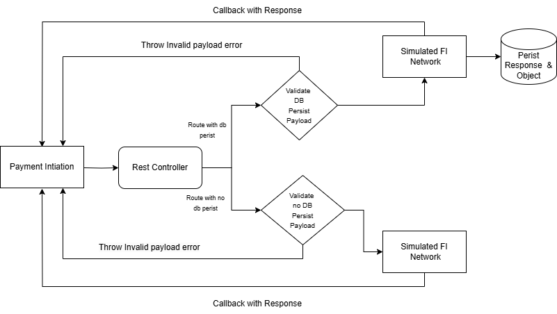
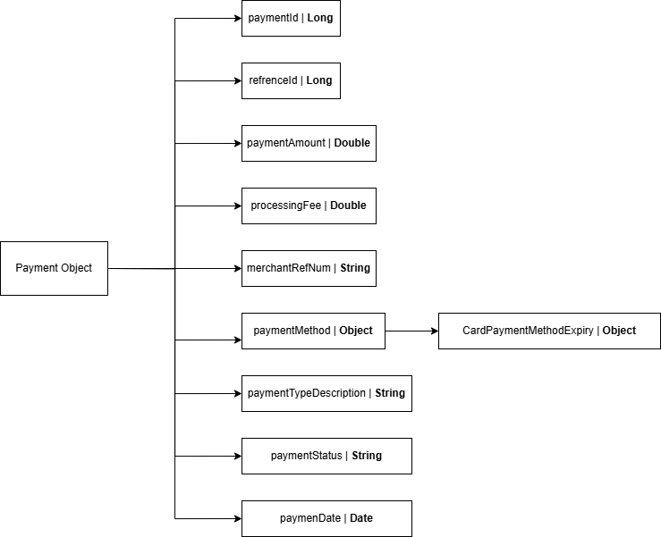

# Mock Payment Gateway

This document provides an overview of the Payment Initiation system. The flowchart outlines how the system processes a payment request, validates the payload, and interacts with the simulated financial institution (FI) network.

# Demo

* **PostMan collection** - 
* **Payment Method Scenarios** 
  * ACH - All ACH payments are by default SUCCESS
  * CARD/ACCOUNT NUMBERS - 
    * SUCCESS - 4111111111111111,5454545454545454
    * DECLINED - 4917484589897107
    * All other cards will result in FAILURE payment status
## System Design

### 1. Payment Initiation
- The entry point for initiating a payment.
- The payment request is sent to the system for processing.

### 2. Rest Controller
- The core controller responsible for routing the request.
- It performs initial checks and determines whether the request should be persisted to the database before validation.
- It follows two main routes:
  - **Route with DB Persist**: The payload is validated and persisted to the database.
  - **Route with No DB Persist**: The payload is validated but not persisted to the database.

### 3. Validation & Payload Persistence
- The system performs payload validation to ensure that the input data adheres to the expected format.
- If invalid data is detected, an error is thrown: **With error message(errorMsg) and error key(errorCode) highlighting the wrong info**.
- For valid payloads, depending on the route, the system either:
  - **Validates with DB Persistence**: The payload is validated and stored in the database.
  - **Validates without DB Persistence**: The payload is validated, but no database operation is performed.

### 4. Simulated FI Network
- After payload validation, the system forwards the request to a simulated financial institution (FI) network.
- This component handles the interaction with the simulated FI network and returns a response.

### 5. Callback with Response
- The system sends a callback response with the results of the transaction.
- For persisted data, the response and the associated object are stored in the database for future reference.

## Flow Overview

1. A payment is initiated via the **Payment Initiation** component.
2. The **Rest Controller** routes the request:
   - If the request should be persisted, it follows the **Route with DB Persist**.
   - Otherwise, it follows the **Route with No DB Persist**.
3. The payload is validated:
   - If invalid, an **Invalid Payload Error** is thrown, and the process terminates.
   - If valid, the system persists the data (if required) and proceeds to the next step.
4. The validated payload is forwarded to the **Simulated FI Network**, which processes the payment.
5. After processing, the **Callback with Response** sends the result back to the originating system.
   - For persisted routes, the response is also stored in the database.

## Error Handling

- The system throws an **Invalid Payload Error** when the request fails to meet validation criteria. This terminates the process and sends an error response back to the initiating party.

## Data Persistence

- If the request is routed for database persistence, the payload and response are stored in the database for future reference.
- In the case of non-persistent routes, no data is stored, but the system still interacts with the FI network and sends a callback with the response.

## Payment Object Schema

